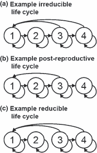
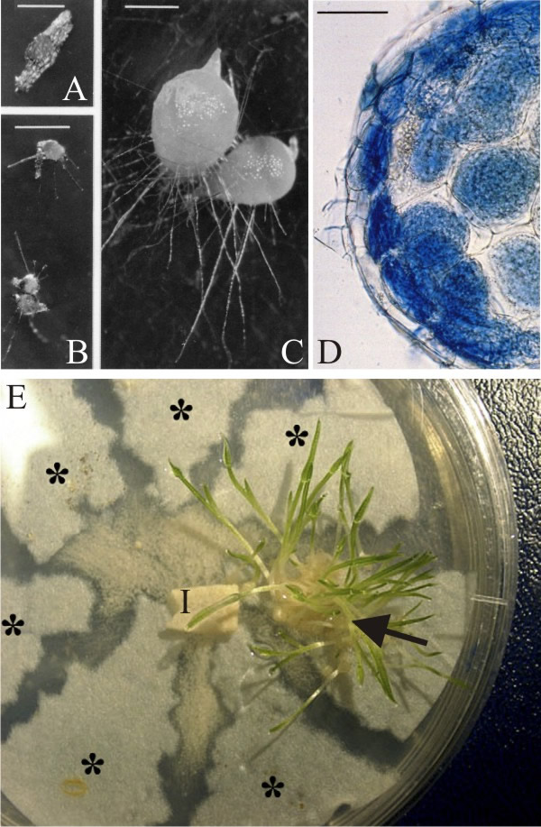
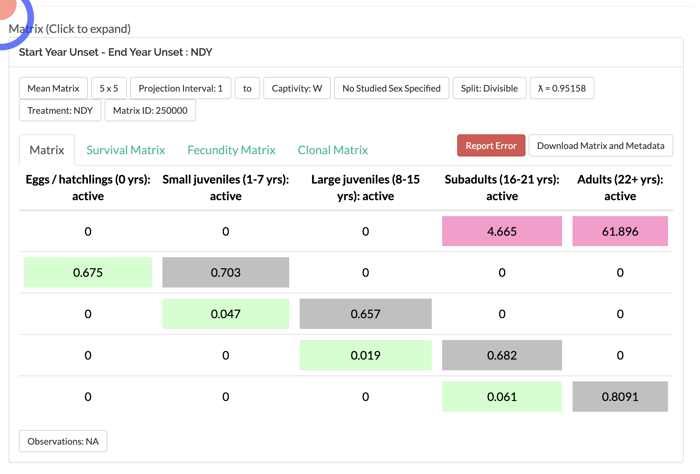

```{r setup, include=FALSE}
knitr::opts_chunk$set(echo = TRUE)
```


### APPENDIX S1
 - R code for figures
 - This appendix provides R code for producing the figures included in the main manuscript.
 - Install the library using install.packages() or by downloading from http://cran.R-project.org


### Load the library


```{r}
library(popdemo)
library(popbio)
#remotes::install_github("jonesor/Rage")
```

*Lepanthes* is one of the largest genera of the Orchidaceae with >1200 species, found only in the Neotropics.  


***

Here is photo of the flower of *Lepanthes rubripetala*, 


A population of *Lepanthes rupestris*, those of *Lepanthes rubripetala* growth in the same way (on rocks or trees), so these groups of individuals are discrete and may be seperated by large distances. 

***


***

## Articulo para guiar su aprendizaje

 

[Tremblay, Raventos Ackerman](PDF/When stable-stage equilibrium is unlikely- integrating transient population dynsmics.pdf). Habrá un quiz de comprobación de lectura al principio de la clase.  

***

# *Lepanthes rubripetala* population #3

### How to construct a matrix in R

```{r, eval=FALSE, echo=FALSE}
R3T=matrix(c(
        0.43, 	0,	    0,    0.0,
        0.38,	  0.84, 	0,	  0, 
        0, 	    0,	    0.51,	0.15,	
        0,      0.14,   0.43, 0.84
        ), byrow=TRUE, ncol=4)

R3F=matrix(c(
        0, 	0,	0, 0.14,
        0,	0, 	0,0,
        0,0,0,0,	
        0,0,0,0
        ), byrow=TRUE, ncol=4)
 
TF_TF=R3T+R3F

TF_TF

TF=TF_TF

```


```{r, eval=FALSE, echo=FALSE}
library(Rage)

colnames(TF_TF) <- c("plantulas", "juveniles", "adulto no reproductivos", "adultos reproductivos")
rownames(TF_TF) <- colnames(TF_TF)

#stages <- c(TF_TF) 
plot_life_cycle(TF_TF, node_order = c(1,2,3,4))
```


En general lo que uno hace es separar la matriz de transciones (matU) de la matriz de fecundidad (matF).  Eso es para tener claro los procesos que ocurren en la población.   Sumando ambas matriz **matU**+**matF** = **matA** tenemos la matriz para evaluar la dinamica poblacional de esa población.  Nota que eso es la nueva terminología que van a encontrar en la literatura reciente,  **matU** y **matF** y **matA**

```{r}

library(Rage)
matU=matrix(c(
0.43, 	0,	    0.00,   0.00, 
0.38,	  0.84,   0.00,	  0.00, 
0, 	    0.00,	  0.51,	  0.15,
0,      0.14,   0.43,   0.84),
byrow=4, ncol=4)

matU


matF=matrix(c(
0, 	  0,	  0,    0.14,
0,	  0, 	  0,	  0, 
0, 	  0,	  0,	  0,	
0,    0,    0,    0
), byrow=4, ncol=4)

matF

TF=matU+matF
TF


colnames(TF) <- c("plantulas", "juveniles", "adulto no reproductivos", "adultos reproductivos")
rownames(TF) <- colnames(TF)
TF
orchid_names= c("1_plantulas", "2_juveniles", "3_adulto no reproductivos", "4_adultos reproductivos")


orchid_names_2= c("1", "2", "3", "4")
#stages <- c(TF_TF) 
plot_life_cycle(TF) 
#plot_life_cycle(TF, stages = orchid_names_2)
```
***


Here is the theoretical life cycle of the species
 


***

```{r, eval=FALSE, echo=FALSE}
matB=matrix(c(
0.43, 	0.000,	0.0000,   0.14,
0.38,	  0.74, 	 0.0000,	0.000, 
0.0000, 0.000,	 0.5100,	0.1500,	
0.0000, 0.1400, 0.4300,   0.8400), byrow=4, ncol=4)

colnames(matB) <- c("plantulas", "juveniles", "adulto no reproductivos", "adultos reproductivos")
rownames(matB) <- colnames(matB)

stages_orchid <- c("plantulas", "juveniles", "adulto no reproductivos", "adultos reproductivos")

matB

plot_life_cycle(matB)
```


***

### Crecimiento poblacional intrinsico

La definición de **crecimiento poblacional asimptotico":   Si nada más cambia, la población eventualmente alcanza la **distribución de etapa estable** y la **razón de cambio de la población** se acerca a una tasa constante (la tasa de crecimiento demográfico asintótica).


lambda = 1: la población es estable

lambda < 1: la población reduce en tamaño

lambda > 1: la población aumenta

This is a measure of the asymptotic population growth rate of the species
```{r}

TF
library(popbio)
lambda(TF) # crecimiento de 3% 
```


### Ejercicio 1

Cambie el valor de supervivencia de los adultos reprodutivos a la mitad y evalue el crecimiento de la población. 

```{r}

library(Rage)
matU1=matrix(c(
0.43, 	0,	  0,    0.00,
0.38,	0.84, 	0,	  0, 
0, 	    0,	  0.51,	0.15,	
0,      0.14, 0.43, 0.44
), byrow=4, ncol=4)

matU1


matF1=matrix(c(
0, 	  0,	  0,    0.14,
0,	  0, 	  0,	  0, 
0, 	  0,	  0,	  0,	
0,    0,    0,    0
), byrow=4, ncol=4)

matF1

TF1=matU1+matF1
TF1
lambda(TF1)
```


### Ejercicio 2

Cambie el de reproducción a 100% de la matriz original. 

```{r}

library(Rage)
matU2=matrix(c(
0.43, 	0,	  0,    0.00,
0.38,	0.84, 	0,	  0, 
0, 	    0,	  0.51,	0.15,	
0,      0.14, 0.43, 0.84
), byrow=4, ncol=4)

matU2


matF2=matrix(c(
0, 	  0,	  0,    3.6,
0,	  0, 	  0,	  0, 
0, 	  0,	  0,	  0,	
0,    0,    0,    0
), byrow=4, ncol=4)

matF2

TF2=matU2+matF2
lambda(TF2)

x=c(3,4,8,3,3,5,2,7,2,4,2,2,3,3,3)
sum(x)

mean(x)
```

***

## Dos posible problemas se tiene que considerar antes de hacer los analisis  

 - **Ergodicity**
    - la condición que irrelevante cual es el la etapa inicial, el crecimiento poblacional asimptotico sera igual 

 - **Irreducibility**
    - la condición que las transiciones de todas las etapas a otra son posibles.  
    
    
Recuerda la definición de **crecimiento poblacional asimptotico":   Si nada más cambia, la población eventualmente alcanza la **distribución de etapa estable** y la **razón de cambio de la población** se acerca a una tasa constante (la tasa de crecimiento demográfico asintótica).    

Si no cumple con esas condiciones los analisis pueden ser severamente impactado. (Stott et al., 2010a).


Pueden probar esas dos condiciones usando las funciones en "popdemo". 

```{r}
library(popdemo)
isErgodic(TF, digits=10, return.eigvec=FALSE)
isIrreducible(TF)

plot_life_cycle(TF)
```
 
 lambda(TF)
 
 ***
 
#### Ergodica
 
 Evaluamos una población que no es *Ergodica*
 
- Cualquiera que sea la estructura de la etapa inicial que se utilice en la proyección de población, siempre exhibirá la misma tasa de crecimiento asintótica estable. 

```{r} 
 library(Rage)
matU4=matrix(c(
0.43, 	0,	    0,     0.00,
0.38,	  0.84, 	0,	   0, 
0.00,   0,	    0.51,	 0.15,	
0,      0.0,    0.43,  0.84
), byrow=4, ncol=4)

matU4  # ¿Cual es el problema con esa matriz?


matF4=matrix(c(
0, 	  0,	  0,    0.28,
0,	  0, 	  0,	  0, 
0, 	  0,	  0,	  0,	
0,    0,    0,    0
), byrow=4, ncol=4)

matF4

TF4=matU4+matF4

isErgodic(TF4)
isIrreducible(TF4)

plot_life_cycle(TF4)
```
 

***

#### Irreducible
 
 Evaluamos una población que no es *Ergodica*
 
 
El gráfico del ciclo de vida asociado contiene las tasas de transición necesarias para facilitar los caminos desde todas las etapas a todas las demás etapas

```{r} 
 library(Rage)
matU4=matrix(c(
0.43, 	0,	  0,    0.00,
0.38,	0.84, 	0,	  0, 
0, 	    0,	  0.51,	0.15,	
0,      0.0, 0.43, 0.84
), byrow=4, ncol=4)

matU4  # ¿Cual es el problema con esa matriz?


matF4=matrix(c(
0, 	  0,	  0,    0.28,
0,	  0, 	  0,	  0, 
0, 	  0,	  0,	  0,	
0,    0,    0,    0
), byrow=4, ncol=4)

matF4

TF4=matU4+matF4

isIrreducible(TF4)

plot_life_cycle(TF4)
```




***


## Realidad de la recopilación de datos

Sin embargo, los datos de la siguiente matriz son limitados porque la colonización de semillas no se puede detectar en el campo con facilidad, porque las semillas son demasiado pequeñas y no existe una técnica rápida en el campo para detectar los hongos simbióticos y la colonización de los hongos entrando en la semilla. 




***


Esta matriz se basa en el tamaños o carateristicas observable en el campo, con una fecundidad media.
 Las clases de tamaño son las siguientes:
 
 - 1: Plántula
 - 2: Juveniles
 - 3: A0: adultos no reproductivos
 - 4: A+: adultos reproductivos


###########################################################################

#FIGURE 1: POPULATION PROJECTION
#


#This figure is designed to be 3.5" by 3.5"
#(Check size of plot window using 'par(din)').
#
#
#Set margins:
par(mar=c(5,4,1,1))

#Create a population vector. 
This one is biased towards adults.

```{r}
n0 <- c(10, 10, 10, 10)

```


## Now project the population for x years in the future.  


Project the orchid PPM and population vector.  In this case, we are projecting for 24 time intervals.  The orchid interval is one month, so this projection is for 2 years.  We use the function 'project'.


```{r}
pr1 <- project(TF, vector=n0, time=100)

#Plot the projection. This uses an S3 plotting
#method for projections. For info, see '?plot.projection'.  
plot(pr1)

```


## Primitive Matrix

For a primitive matrix (see below), the long-term growth rate is the real part of the first dominant eigenvalue of the PPM.

```{r}
eigs <- eigen(TF)
eigs
lambdamax <- Re(eigs$values[1]) # esta función seleciona para el primer valor
lambdamax

# Es más facil utilzar la siguiente función en el paquete popdemo

truelambda(TF) # Con el paquete popdemo
lambda(TF) # con el paquete popbio
```

Stable Stage distribution 


The stable demographic structure of the population is equal to the dominant right eigenvector, which is the absolute value of the real part of the first eigenvector.

This is the expected proportional distribution among the different stages **IF** the population attains a sable structure.   

Compara la porporción que hay por etapas al principio de la investigación

n0 <- c(10, 10, 10, 10)

```{r}


w <- stable.stage(TF)
w
```

Note that the package popbio provides functions 'lambda' and 'stable.stage' that will provide these also.

• Elasticity: the proportional change in population growth rate resulting from an equivalent proportional change in a specific vital rate.

• Elasticidad: el cambio proporcional en la tasa de crecimiento de la población resultante de un cambio proporcional equivalente en una tasa vital específica.


```{r}
elas(TF)
```


Excercise. *Caretta caretta*

Use data from COMADRE: Crowder LB; Crouse DT; Heppell SS; Martin
Reference Type: Journal Article
DOI/ISBN: 10.2307/1941948
Journal Name: Ecol Appl
Title:
Year: 1994
Volume:
Pages:


Caretta caretta: 




```{r}
#remotes::install_github("jonesor/Rage") # eso es para instalar el programa directo de github
```


Las matrices 

```{r}
matUCc=matrix(c(
0,	    0,   	     0,	    0,     0,
0.675,	0.703,     0,	    0,     0,
0,	    0.047,	   0.657,  0,    0, 
0	,     0,	       0.019,	0.682, 0,
0,      0,         0,     0.061, 0.8091
), byrow=5, ncol=5)


matFCc=matrix(c(			
0,	0,	0,	4.665, 61.896,
0,	0,	0,	0, 0,
0,	0,	0,	0, 0,
0,	0,	0,	0, 0,
0,  0,  0,  0, 0
), byrow=5, ncol=5)

matACc=matUCc+matFCc

matACc

plot_life_cycle(matACc)


colnames(matACc) <- c("Huevos", "small_juv(1-7yrs)", "Large_juv(8-15)", "Subadults(16-21)", "Adults(22+)")
rownames(matACc) <- colnames(matACc)


library(Rage)
plot_life_cycle(matACc) # life cycle with names


```


```{r}
truelambda(matACc)
lambda(matACc)

```
Plot turtle growth

```{r}

nCc <- c(10, 10, 10, 10, 1000)
pr1 <- project(matACc, vector=nCc, time=240)

#Plot the projection. This uses an S3 plotting
#method for projections. For info, see '?plot.projection'.  
plot(pr1)
```

## Elasticities
Perturbation analysis is an intuitively appealing way to answer questions about the relative importance of variation in parameters in the matrix. ... Elasticity analysis estimates the effect of a proportional change in the vital rates on population growth rate λ (= er, where r is the per capita rate of population increase)1, 2.


```{r elasticities}
matACc # the matrix matU


round(elas(matACc),digit=4) # elas=elasticities, en el paquete "popdemo"
```


## Stable Stage distribution.

La proporción de individuos por etapa cuando la población llega a su estabilidad/madura

```{r}

stable.stage(matACc) # en el paquete popdemo
```


## Convergence Time

Convergence Time is the expected time for a population at attain stable stage distribution. Calculate the time to convergence of a population matrix projection model from the model projection.
 convt(A, vector = "n", accuracy = 0.01, iterations = 1e+05)

```{r}
# convt, en popdemo
n=c(1000,0,0,0, 0)
convt(matACc, accuracy=1e-3, vector=n) # Convergence time to Stable Stage Distribution

n1=c(238,648,103,7, 3)
convt(matACc, accuracy=1e-3, vector=n1) # Convergence time to Stable Stage Distribution


```


# Damping Ratio
The damping ratio (ρ) is a measure of how fast a population will converge to the stable stage distribution and is defined as the dominant eigenvalue (λ1) divided by the absolute value of the largest subdominant eigenvalue (λ2) (Caswell 1989).

Thus small damping ratio suggest that populations will take a long time to attain stable stage distribution, while large damping ratio, the stable stage distribution will be attain within a few time periods.  

```{r}

dr(matACc)
dr(matACc, return.time=TRUE, x=10) # damping ratio

```


*******

###########################################################################

## TRANSIENT DYNAMICS

__________________________________________________________________________
#
Fig. 2a: Population-specific transient dynamics
#
This figure is designed to be 3.5" by 3.5"
(Check size of plot window using 'par(din)').


Set margins:

```{r}
par(mar=c(10,4,1,1))
```


Create 2 population vectors.  One is adult-
biased, and it amplifies.  One is juvenile-
biased and it attenuates.

```{r}
n0.att <- c(1000,1,1,1)

n0.amp <- c(1,1,1,1000)
```


Project these vectors using the project function.
We are standardising the matrix using 'standard.A=T'
to remove effects of asymptotic dynamics. This 
means that the projection has a long-term growth
rate of unity, i.e. it does not grow or decline in 
the long-term.  We also standardise the population
vector to sum to 1 using 'standard.vec=T'.
These standardisations make it easier (and fairer)
to compare between models with different population 
sizes, and different long-term growth rates.

```{r}
pr2.1amp <- project(TF, vector=n0.amp, time=50, 
                 standard.A=T, standard.vec=T)
pr2.2att <- project(TF, vector=n0.att, time=50, 
                 standard.A=T, standard.vec=T)
```


Plot the amplification projection and label it

```{r}
plot(pr2.2att, ylim=c(0.4,1.0), log="y", cex.axis=0.8)
text(30, pr2.2att[10], "attenuation", 
     adj=c(1,-0.5), cex=0.8)


plot(pr2.1amp, ylim=c(0.4,1.2), log="y", cex.axis=0.8)
text(30, pr2.1amp[10], "amplification", 
     adj=c(1,-.25), cex=0.8)
maxamp(TF )
reac(TF,bound = "upper")
inertia(TF,bound = "lower")
```
Calculate the transient dynamics of the
amplification projection.  


```{r}
reac <- reac(TF, vector=n0.amp)
maxamp <- maxamp(TF,  return.t=T)
upinertia <- inertia(TF, vector=n0.amp)
```


Add points on the projection for amplification
and label them

```{r, eval=FALSE}
par(mar=c(10,4,1,1))
points(c(1,maxamp$t,31), c(reac,maxamp$maxamp,upinertia), 
       pch=3, col="red")
text(1, reac, expression(bar(P)[1]), 
     adj=c(-0.3,0.5), col="red", cex=0.8)
text(maxamp$t, maxamp$maxamp, expression(bar(P)[max]), 
     adj=c(0.1,-0.5), col="red", cex=0.8)
text(31, upinertia, expression(bar(P)[infinity]), 
     adj=c(0.1,-0.5), col="red", cex=0.8)

#Add in the second projection using the
#'lines' command and label it
lines(0:50, pr2.2)
text(52, pr2.2[51], "attenuation", adj=c(1,1), cex=0.8)
```
Calculate the transient dynamics of the 
attenuation projection
firstep <- firststepatt(TF, vector=n0.att)
maxatt <- maxatt(TF, vector=n0.att, return.t=T)
lowinertia <- inertia(TF, vector=n0.att)

firststepatt(TF, vector=n0.att)
maxatt(TF, vector=n0.att, return.t=T)
inertia(TF, vector=n0.att)

Add points on the attenuation projection
and label them
points(c(1,maxatt$t,31), c(firstep,maxatt$maxatt,lowinertia), 
       pch=3, col="red")
text(1, firstep, expression(underline(P)[1]), 
     adj=c(0,-0.6), col="red", cex=0.8)
text(maxatt$t, maxatt$maxatt, expression(underline(P)[min]), 
     adj=c(0.1,1.5), col="red", cex=0.8)
text(31, lowinertia, expression(underline(P)[infinity]), 
     adj=c(0.1,1.5), col="red", cex=0.8)

Add in a dotted line at y=1
lines(c(0,50),c(1,1),lty=2)

__________________________________________________________________________

Fig. 2b: Transient bounds
This figure is designed to be 3.5" by 3.5"
(Check size of plot window using 'par(din)').

Set margins:
par(mar=c(5,4,1,1))

Transient bounds result from projections of
the stage-biased dynamics of the model.
When using the function 'project', the
stage-biased model dynamics are projected 
automatically if no population vector is specified.
We can do this for the orchid, using a 
standardised matrix like before:
pr2 <- project(TF, standard.A=TRUE, time=156)

Now we need to plot these population dynamics.
The S3 method for projections automatically plots
all stage-biased projections:
plot(pr2, log="y", cex.axis=0.8, ylim=c(0.4,1.5))

Add in a dotted line at y=1
lines(c(0,156), c(1,1), lty=2)

Calculate the bounds on transient dynamics for
the orchid.  This is also done automatically if
no population vector is specified.
reacb <- reactivity(TF)
firstepb <- firststepatt(TF)
maxampb <- maxamp(TF, return.t=T)
maxattb <- maxatt(TF, return.t=T)
upinertiab <- inertia(TF, bound="upper")
lowinertiab <- inertia(TF, bound="lower")


reactivity(TF)
firststepatt(TF)
maxamp(TF, return.t=T)
maxatt(TF, return.t=T)
inertia(TF, bound="upper")
inertia(TF, bound="lower")


Add points on the projection and label them
points(c(1,1,maxampb$t,maxattb$t,31,31),
       c(reacb,firstepb,maxampb$maxamp,maxattb$maxatt,upinertiab,lowinertiab),
       pch=3,col="red")
text(1, reacb, expression(bar(rho)[1]), 
     adj=c(-0.5,0.5), col="red", cex=0.8)
text(1, firstepb, expression(underline(rho)[1]),
     adj=c(-0.5,1.5), col="red", cex=0.8)
text(maxampb$t, maxampb$maxamp, expression(bar(rho)[max]),
     adj=c(0.1,-0.5), col="red", cex=0.8)
text(maxattb$t, maxattb$maxatt, expression(underline(rho)[min]),
     adj=c(0.1,1.5), col="red", cex=0.8)
text(31, upinertiab, expression(bar(rho)[infinity]), 
     adj=c(0.1,-0.5), col="red", cex=0.8)
text(31, lowinertiab, expression(underline(rho)[infinity]),
     adj=c(0.1,1.5), col="red", cex=0.8)

Amplification bounds result from the projection of a
population with 100% stage x individuals.  Attenuation
bounds result from the projection of a population with
100% stage 1 individuals.


######################################################################

FIGURE 3: TRANSFER FUNCTIONS

__________________________________________________________________________

Fig. 3a: Transfer function of asymptotic growth

This figure is designed to be 3.5" by 3.5"
(Check size of plot window using 'par(din)').

Set margins:
par(mar=c(5,4,1,1))

Create a transfer function using 'tfa'.
The perturbation structure is determined by
two vectors d and e.  The matrix d%*%t(e) gives the 
structure, where nonzero elements in this matrix
are the elements of the PPM to be perturbed.  The
relative size of entries in this matrix are the relative
sizes of perturbation to those elements.
In this case, we are perturbing element [5,4].
We are going to look at the effect of perturbing
up to 0.25.  The largest biologically reasonable 
perturbation is about 0.12.
tf1 <- tfa(TF, d=c(1,0,0,0), e=c(0,0,1,0), 
         prange=seq(0,0.25,0.01))

Now we plot this using an S3 method for transfer functions
(for information see '?plot.tfa').
plot(tf1, cex.axis=0.8)

Now we're going to add in the sensitivity tangent.  This has
an intercept of lambda-max, and a slope of the sensitivity
of the same transfer function.
Calculate lambda-max of the desert tortoise PPM:
lambda <- Re(eigen(LaeliaZ1)$values[1])

Calculate the sensitivity using the function 'tfsens':
sens1 <- tfsens(TF, d=c(0,0,0,1), e=c(0,0,1,0))

Now add in the line, specifying the correct intercept and slope:
abline(lambda, sens1, lty=2, col="red")

__________________________________________________________________________

Fig. 3b: Transfer function of population inertia

This figure is designed to be 3.5" by 3.5"
(Check size of plot window using 'par(din)').

Set margins:
par(mar=c(5,4,1,1))

The process is very similar to above.  We need to specify
a PPM, perturbation structure and perturbation range.  For
inertia we either have to specify a population vector using
the 'vector' argument, or the bound to be calculated using the
'bound' argument.
Create a population vector:
n0 <- c(1,8,13,21)

tf1 <- tfa(TF, d=c(0,0,0,1), e=c(0,0,1,0), 
         prange=seq(0,0.25,0.01))

Now calculate the transfer function using inertia.tfa:
tf2 <- inertia.tfa(TF, vector=n0, d=c(0,0,0,1), 
                 e=c(0,0,1,0), prange= seq(0,0.25,0.01))

Plot the transfer function using the same S3 method as before:
plot(tf2, cex.axis=0.8, ylim=c(3.9,4.43))

The sensitivity tangent for transfer function of inertia has
an intercept of equal to the relevant inertia (either using 
the same population vector, or the correct bound), and a slope 
of the sensitivity of the same transfer function.
Calculate inertia of the desert tortoise PPM using the
population vector:
inertia <- inertia(TF, vector=n0)

Calculate the sensitivity using the function 'inertia.tfsens':
sens2 <- inertia.tfsens(TF, vector=n0, d=c(0,0,0,1), 
                        e=c(0,0,1,0), tolerance=1e-5)

(Here the 'tolerance' has had to be lowered to avoid calculation error:
try the function without that argument and it will have trouble running)

Now add in the line, specifying the correct intercept and slope:
abline(inertia, sens2, lty=2, col="red")


#########################################################################

FIGURE 4: TRANSFER FUNCTION MATRIX

This figure is designed to be 7" by 7"
(Check size of plot window using 'par(din)').

This is a nice, easy plot because the function does it all for you.
The functions 'tfmat' and 'inertia.tfmat' calculate a transfer function
for every PPM element.  They are saved as arrays of values.  The functions
are customisable: see '?tfmat' and '?inertia.tfmat'.

Create the array for inertia, using a specific population vector:
n0 <- c(48, 16, 12, 10)
tfmat <- inertia.tfamatrix(TF, vector=n0)

...and plot it!
plot(tfmat)

n0 <- c(48, 16, 12, 10)
tfmat <- tfamatrix(TF)

...and plot it!
plot(tfmat)


